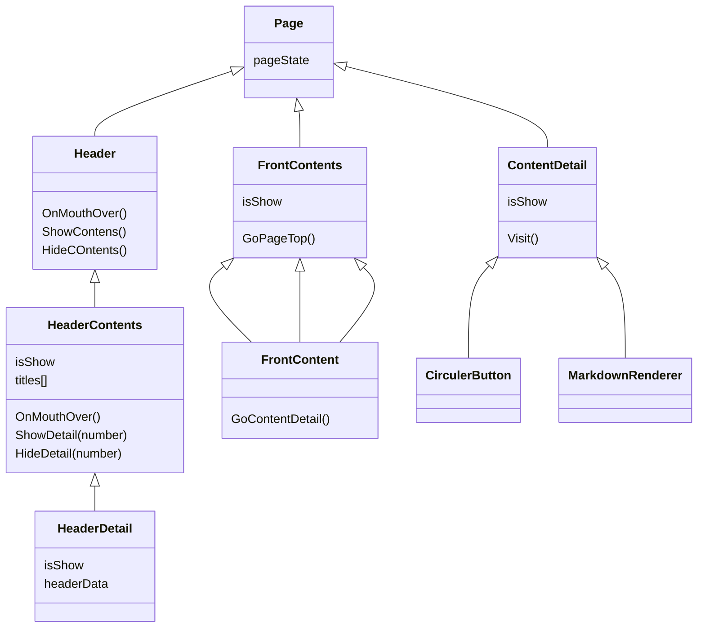

# この Web サイトについて

## 概要

- **期間**:3 週間
- **人数**:1 人
- 制作環境
  - Windows11
  - Next.js 14.2.5
  - React

## 詳細

- これまでの自身の活動を公開するための Web サイト
- 以下の情報によって構成
  - 簡単なプロフィール
  - 学歴・職歴
  - スキルセット
  - 個人製作物

## 開発詳細

#### インフラ構築

- さくら VPS で借りた VPS 上に、apache と Next.js で作成した本サイトを配置している
  
  - SSH 接続を公開鍵認証方式に切り替え
  - apache をインストールしてサーバーを公開
    - SSL/TLS 証明書を登録して https 通信を可能に
    - ドメインを取得して DNS サーバに登録
  - Web サイトを配置
    - Node.js を配置しサーバーとして起動
    - apache でリバースプロキシを設定

#### アーキテクチャ設計

- AppRouter を用いて単一 URL で実装
- 最上位の pageState でページの状態を保持して管理
- フロント、ヘッダー、詳細のコンポーネントは再利用可能
  - pageState やデータを受け取ってコンテンツを出力
- 詳細ページはマークダウンファイルをロードして出力

## React の選定理由

- コーデイング
  - コンポーネントベース設計によって再利用性・保守性が高い
    - フロント、ヘッダー、詳細のコンポーネントは再利用可能に
  - 宣言的プログラミングスタイルによってコードの可読性・メンテナンス性向上
  - React Hooks によるシンプルかつ強力な状態管理機能
    - 最上部の一つの状態のみでページを管理
- パフォーマンス
  - 仮想 DOM による効率的なレンダリングでパフォーマンス向上
    - 3D の動きも効率的に実装
- 拡張性
  - 豊富なエコシステムとコミュニティサポートによる拡張性
    - マークダウン、2D・3D の UI、アニメーションなどを豊富なライブラリ、モジュールを用いて実装

## 学び

- サーバーやインフラの構築について理解
- いくつかの web サイト制作方法を比較し、技術選定する方法を習得
