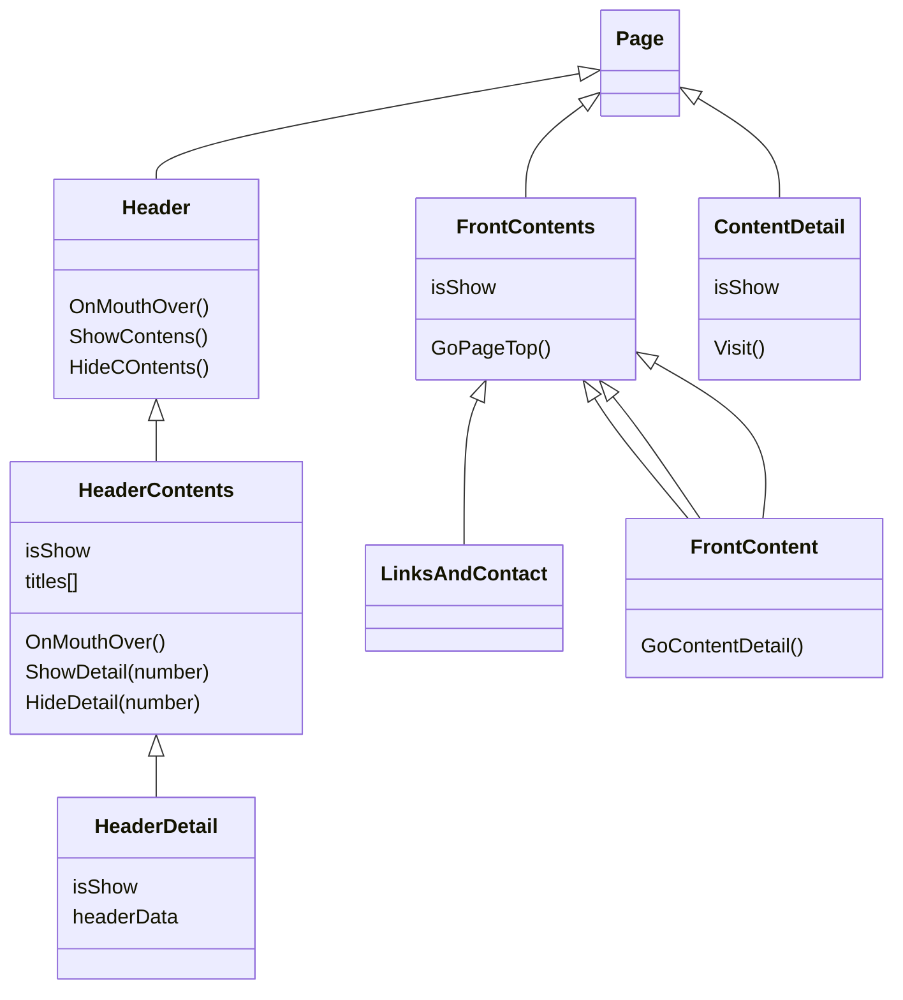

### 目次 <!-- omit in toc -->

- [1 要件](#1要件)
- [構成](#構成)

# 1 要件

- 載せたい内容
  - 職歴
  - 技術分野
  - 今後の展望
  - 成果物
  -
- 見せ方
  - ヘッダーに内容一覧
    - 普段は非表示でカーソル合わせると出る
    - カーソル合わせると広がる(apple のサイトにみたいに)
  - トップページはスクロールしていくと内容一覧が並んでいる
    - 一つ一つはスクロールアニメーション搭載

# 構成

