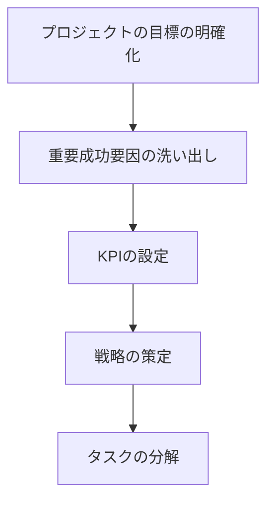
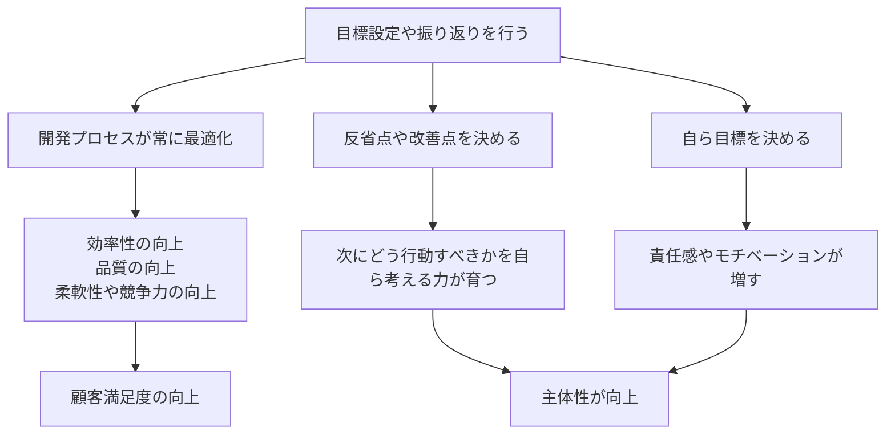

## 仕事で大切にしていること

### 1.常に目的を意識すること

- プロジェクトの目的・目標を常に意識し、そこから逆算して業務を進めることが重要だと考えています。
- 以下の点を考慮することで、効率的かつ論理的にプロジェクトを進められます。
  - 現在の作業がプロジェクトの目標達成にどのように貢献しているか
  - 目標達成に無関係な作業が含まれていないか

### 2.PDCA サイクル

- 作業自体（Do）と同様に、計画（Plan）を立てることや振り返り（Check, Act）が重要だと考えます。
- 振り返りを行うことで以下の効果が期待できます。
  - プロセス改善による生産性向上
  - 主体的な業務への取り組み
- チームリーダーとして振り返りを促すことを最優先事項としていました。

## 今後のビジョン

### 1.社会への貢献

- 顧客の要望通り実装するだけでなく、自ら価値を生み出せるようになりたいです。
  - 社会の問題を発見し、それを解決するプロダクトを創出
  - 新たなユーザー体験の提供
- 自分自身で考えたアイデアが形になることで、仕事への情熱が高まります。

### 2.マネジメント

- マネジメントを通じて、組織全体の成長に貢献したいです。
- チームリーダー経験から、組織運営の重要性を痛感しました。
  - 組織が適切に機能すれば、個人では不可能な規模やスピードでプロダクトを生み出せます。
  - 不適切な運営では、人員増加で生産性は向上しません。
- 組織を成長させ、適切に運営することに喜びを感じます。
